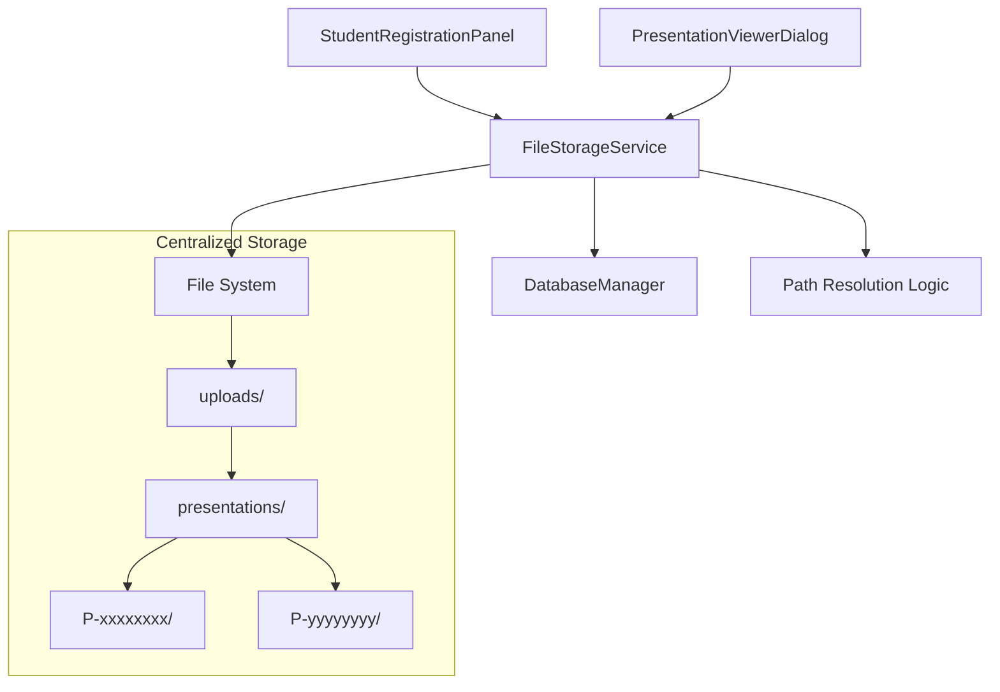
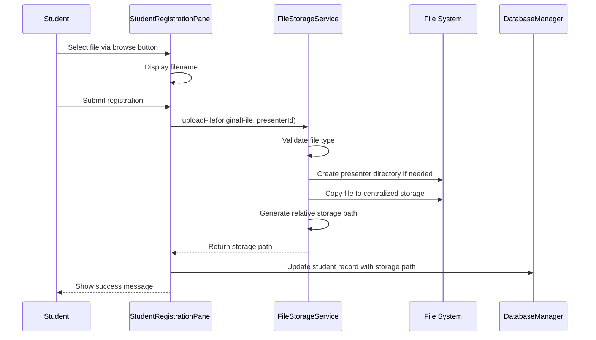

# Design Document: Centralized File Storage

## Overview

The Centralized File Storage feature introduces a robust file management system that replaces the current local path storage approach with a centralized, project-relative storage mechanism. The design implements a new `FileStorageService` class that handles all file operations, including copying files from local sources to a structured directory hierarchy, validating file types, managing storage paths, and cleaning up old files.

The solution integrates seamlessly with existing components (`StudentRegistrationPanel`, `PresentationViewerDialog`, `DatabaseManager`) while maintaining backward compatibility during the transition period. Files are organized by presenter ID to prevent naming conflicts, and all paths are stored as relative paths for portability across different environments.

## Architecture

### High-Level Architecture



### Component Interaction Flow



## Components and Interfaces

### 1. FileStorageService

A new service class responsible for all file storage operations.

**Responsibilities:**
- Validate file types against supported extensions
- Create and manage directory structure
- Copy files from local sources to centralized storage
- Generate relative storage paths
- Delete old files when students re-upload
- Resolve storage paths for file retrieval

**Interface:**

```java
public class FileStorageService {
    // Constants
    private static final String BASE_UPLOAD_DIR = "uploads/presentations";
    private static final Set<String> SUPPORTED_EXTENSIONS = 
        Set.of(".pdf", ".jpg", ".jpeg", ".png", ".gif", ".txt");
    
    // Singleton instance
    private static FileStorageService instance;
    
    /**
     * Get singleton instance
     */
    public static FileStorageService getInstance();
    
    /**
     * Upload a file to centralized storage
     * @param sourceFile The original file from student's local system
     * @param presenterId The presenter's unique ID
     * @return The relative storage path
     * @throws FileStorageException if upload fails
     */
    public String uploadFile(File sourceFile, String presenterId) 
        throws FileStorageException;
    
    /**
     * Validate if file type is supported
     * @param file The file to validate
     * @return true if supported, false otherwise
     */
    public boolean isFileTypeSupported(File file);
    
    /**
     * Get the file extension from a filename
     * @param filename The filename
     * @return The extension (including dot) in lowercase
     */
    private String getFileExtension(String filename);
    
    /**
     * Create presenter directory if it doesn't exist
     * @param presenterId The presenter's unique ID
     * @return The presenter's directory path
     * @throws FileStorageException if directory creation fails
     */
    private Path createPresenterDirectory(String presenterId) 
        throws FileStorageException;
    
    /**
     * Delete old file for a presenter
     * @param presenterId The presenter's unique ID
     * @param excludeFilename Filename to exclude from deletion
     */
    private void deleteOldFiles(String presenterId, String excludeFilename);
    
    /**
     * Resolve a storage path to an absolute File object
     * @param storagePath The relative storage path
     * @return File object pointing to the stored file
     */
    public File resolveStoragePath(String storagePath);
    
    /**
     * Check if a path is an old absolute path (for backward compatibility)
     * @param path The path to check
     * @return true if it's an absolute path
     */
    public boolean isAbsolutePath(String path);
    
    /**
     * Initialize the base upload directory structure
     * @throws FileStorageException if initialization fails
     */
    private void initializeBaseDirectory() throws FileStorageException;
}
```

### 2. FileStorageException

A custom exception class for file storage errors.

**Interface:**

```java
public class FileStorageException extends Exception {
    public enum ErrorType {
        FILE_NOT_FOUND,
        INVALID_FILE_TYPE,
        PERMISSION_DENIED,
        INSUFFICIENT_SPACE,
        COPY_FAILED,
        DIRECTORY_CREATION_FAILED
    }
    
    private ErrorType errorType;
    
    public FileStorageException(String message, ErrorType errorType);
    public FileStorageException(String message, ErrorType errorType, Throwable cause);
    
    public ErrorType getErrorType();
    public String getUserFriendlyMessage();
}
```

### 3. StudentRegistrationPanel (Modified)

**Changes Required:**
- Integrate FileStorageService for file uploads
- Handle FileStorageException and display user-friendly error messages
- Update performRegistration() method to use centralized storage

**Modified Methods:**

```java
private void performRegistration() {
    // ... existing validation code ...
    
    // Handle file upload if a file was selected
    String storagePath = null;
    if (selectedFile != null && selectedFile.exists()) {
        try {
            FileStorageService fileService = FileStorageService.getInstance();
            
            // Validate file type
            if (!fileService.isFileTypeSupported(selectedFile)) {
                ErrorHandler.showError(this, 
                    "Unsupported file type. Please upload PDF, image (JPG, PNG, GIF), or text files.");
                return;
            }
            
            // Upload file to centralized storage
            storagePath = fileService.uploadFile(selectedFile, student.getPresenterId());
            
        } catch (FileStorageException e) {
            ErrorHandler.showError(this, e.getUserFriendlyMessage());
            return;
        }
    }
    
    // Update student's file path with storage path
    if (storagePath != null) {
        student.setFilePath(storagePath);
    }
    
    // ... rest of existing code ...
}
```

### 4. PresentationViewerDialog (Modified)

**Changes Required:**
- Use FileStorageService to resolve storage paths
- Maintain backward compatibility with absolute paths

**Modified Methods:**

```java
private void loadMaterials() {
    String filePath = student.getFilePath();
    
    if (filePath == null || filePath.isEmpty()) {
        showError("No presentation materials uploaded for this student");
        return;
    }
    
    FileStorageService fileService = FileStorageService.getInstance();
    
    // Resolve the path (handles both relative and absolute paths)
    if (fileService.isAbsolutePath(filePath)) {
        // Backward compatibility: handle old absolute paths
        currentFile = new File(filePath);
    } else {
        // New relative paths
        currentFile = fileService.resolveStoragePath(filePath);
    }
    
    if (!currentFile.exists()) {
        showError("File not found: " + filePath);
        return;
    }
    
    // ... rest of existing code ...
}
```

### 5. DatabaseManager (No Changes Required)

The existing `file_path` column in the `users` table will store relative paths instead of absolute paths. No schema changes are needed.

## Data Models

### File Storage Structure

```
project-root/
├── uploads/
│   └── presentations/
│       ├── P-24695d0c/
│       │   ├── research-paper.pdf
│       │   └── presentation-slides.pdf
│       ├── P-7caeda11/
│       │   ├── poster-design.png
│       │   └── abstract.txt
│       └── P-xxxxxxxx/
│           └── materials.pdf
```

### Storage Path Format

**Relative Path Pattern:** `uploads/presentations/{presenter_id}/{filename}`

**Examples:**
- `uploads/presentations/P-24695d0c/research-paper.pdf`
- `uploads/presentations/P-7caeda11/poster-design.png`

### Database Schema (Existing)

The `users` table already has a `file_path` column that will store the relative storage paths:

```sql
CREATE TABLE users (
    ...
    file_path VARCHAR(500),
    ...
);
```

**Before (Absolute Path):**
```
C:\Users\Student\Documents\presentation.pdf
```

**After (Relative Path):**
```
uploads/presentations/P-24695d0c/presentation.pdf
```


## Correctness Properties

*A property is a characteristic or behavior that should hold true across all valid executions of a system—essentially, a formal statement about what the system should do. Properties serve as the bridge between human-readable specifications and machine-verifiable correctness guarantees.*

### Property 1: Directory Structure Consistency

*For any* presenter ID, when a file is uploaded, the system should create the directory structure following the pattern `uploads/presentations/{presenter_id}/` if it doesn't already exist

**Validates: Requirements 1.1, 1.3**

### Property 2: File Type Validation

*For any* file with an extension, the system should accept the file if and only if its extension (case-insensitive) is in the set {.pdf, .jpg, .jpeg, .png, .gif, .txt}

**Validates: Requirements 2.1, 4.1, 4.2, 4.3, 4.4**

### Property 3: File Copy Preservation

*For any* valid file uploaded by a presenter, the file should be copied to centralized storage with the original filename preserved, and the original file should remain in the student's local system

**Validates: Requirements 2.2, 2.3, 2.4**

### Property 4: Same-Name File Overwrite

*For any* presenter who uploads a file with the same filename twice, only one copy of that file should exist in their centralized storage directory after the second upload

**Validates: Requirements 2.5, 6.1**

### Property 5: Relative Path Generation

*For any* successfully uploaded file, the generated storage path should be relative to the project root and use forward slashes for cross-platform compatibility

**Validates: Requirements 3.1, 3.3**

### Property 6: Database Path Update

*For any* student who uploads a file, the database file_path column should be updated to contain the new storage path

**Validates: Requirements 3.2, 3.4, 6.3**

### Property 7: Filename Isolation by Presenter

*For any* two different presenters who upload files with the same filename, both files should exist in the system without conflict (stored in separate presenter directories)

**Validates: Requirements 1.4**

### Property 8: Old File Cleanup on Different Filename

*For any* presenter who uploads a file with filename A, then uploads a file with filename B, only file B should exist in their centralized storage directory

**Validates: Requirements 6.2**

### Property 9: Non-Existent File Rejection

*For any* file path that does not exist on the file system, attempting to upload that file should result in an error and no changes to the storage system or database

**Validates: Requirements 5.1**

### Property 10: Atomic Operation on Failure

*For any* file upload operation that fails (for any reason), the system state should remain unchanged with no partial updates to either the file system or database

**Validates: Requirements 5.4**

### Property 11: Error Logging

*For any* file operation that results in an error, an error log entry should be created with details about the failure

**Validates: Requirements 5.5**

### Property 12: Storage Path Resolution

*For any* relative storage path stored in the database, resolving that path should produce an absolute file path pointing to the correct location in centralized storage

**Validates: Requirements 7.1**

### Property 13: Missing File Error Handling

*For any* storage path that points to a non-existent file, attempting to load that file should result in a clear error message without crashing the application

**Validates: Requirements 7.2**

### Property 14: Multi-Format File Support

*For any* file with a supported extension (.pdf, .jpg, .jpeg, .png, .gif, .txt), the system should successfully store and retrieve that file from centralized storage

**Validates: Requirements 7.3**

### Property 15: Backward Compatibility with Absolute Paths

*For any* absolute file path (legacy format), the system should correctly identify it as absolute and handle it appropriately during the transition period

**Validates: Requirements 7.4**

### Property 16: Upload Trigger on Form Submission

*For any* student registration form submission with a selected file, the upload operation should be triggered before the student record is saved

**Validates: Requirements 8.3**

### Property 17: Student Record Update on Success

*For any* successful file upload operation, the student record should be updated with the new storage path before form submission completes

**Validates: Requirements 8.4**

### Property 18: Form Submission Prevention on Upload Failure

*For any* file upload operation that fails, the registration form submission should be prevented and an error message should be displayed

**Validates: Requirements 8.5**


## Error Handling

### Error Categories and Responses

The system implements comprehensive error handling through the `FileStorageException` class, which categorizes errors and provides user-friendly messages.

#### 1. File Not Found Errors

**Scenario:** Student attempts to upload a file that no longer exists at the selected path

**Handling:**
- Throw `FileStorageException` with `FILE_NOT_FOUND` error type
- Display message: "The selected file could not be found. Please ensure the file exists and try again."
- Prevent any database updates
- Log the error with the attempted file path

#### 2. Invalid File Type Errors

**Scenario:** Student attempts to upload a file with an unsupported extension

**Handling:**
- Throw `FileStorageException` with `INVALID_FILE_TYPE` error type
- Display message: "Unsupported file type. Please upload PDF, image (JPG, PNG, GIF), or text files."
- Prevent file copy operation
- Log the error with the file extension

#### 3. Permission Denied Errors

**Scenario:** System lacks permissions to read source file or write to destination

**Handling:**
- Throw `FileStorageException` with `PERMISSION_DENIED` error type
- Display message: "Permission denied. Please check file permissions and try again."
- Rollback any partial operations
- Log the error with detailed permission information

#### 4. Insufficient Disk Space Errors

**Scenario:** Not enough disk space to copy the file

**Handling:**
- Throw `FileStorageException` with `INSUFFICIENT_SPACE` error type
- Display message: "Insufficient disk space. Please free up space and try again."
- Rollback any partial operations
- Log the error with available space information

#### 5. Copy Operation Failures

**Scenario:** File copy fails for reasons other than permissions or space

**Handling:**
- Throw `FileStorageException` with `COPY_FAILED` error type
- Display message: "Failed to copy file. Please try again or contact support."
- Rollback any partial operations
- Log the error with exception details

#### 6. Directory Creation Failures

**Scenario:** Unable to create presenter directory structure

**Handling:**
- Throw `FileStorageException` with `DIRECTORY_CREATION_FAILED` error type
- Display message: "Failed to create storage directory. Please contact support."
- Prevent file copy operation
- Log the error with directory path

### Error Recovery Strategy

**Atomic Operations:**
- All file operations are wrapped in try-catch blocks
- On any error, the system ensures no partial state changes
- Database updates only occur after successful file operations
- Failed operations leave the system in its previous valid state

**Logging:**
- All errors are logged with timestamps, error types, and context
- Logs include stack traces for debugging
- Log file location: `logs/file-storage-errors.log`

**User Feedback:**
- All errors result in clear, actionable error messages
- Technical details are logged but not shown to users
- Error dialogs use `ErrorHandler.showError()` for consistency

## Testing Strategy

### Overview

The testing strategy employs a dual approach combining unit tests for specific scenarios and property-based tests for universal correctness properties. This ensures both concrete edge cases and general behavior are thoroughly validated.

### Property-Based Testing

**Framework:** JUnit 5 with jqwik (Java property-based testing library)

**Configuration:**
- Minimum 100 iterations per property test
- Each test tagged with feature name and property reference
- Tag format: `@Tag("Feature: centralized-file-storage, Property N: [property text]")`

**Property Test Coverage:**

1. **Property 1: Directory Structure Consistency**
   - Generate random presenter IDs
   - Upload files and verify directory structure matches pattern
   - Verify directories are created only when needed

2. **Property 2: File Type Validation**
   - Generate random file extensions (both valid and invalid)
   - Verify only supported extensions pass validation
   - Test case-insensitive validation

3. **Property 3: File Copy Preservation**
   - Generate random valid files
   - Verify files are copied (not moved)
   - Verify original filename is preserved

4. **Property 4: Same-Name File Overwrite**
   - Upload file with same name twice
   - Verify only one copy exists

5. **Property 5: Relative Path Generation**
   - Generate random file uploads
   - Verify all paths are relative and use forward slashes

6. **Property 6: Database Path Update**
   - Upload files and verify database contains correct paths
   - Test path updates on re-upload

7. **Property 7: Filename Isolation by Presenter**
   - Generate two different presenter IDs
   - Upload files with same name for both
   - Verify both files exist without conflict

8. **Property 8: Old File Cleanup on Different Filename**
   - Upload file A, then file B for same presenter
   - Verify only file B exists

9. **Property 9: Non-Existent File Rejection**
   - Generate paths to non-existent files
   - Verify upload fails with appropriate error

10. **Property 10: Atomic Operation on Failure**
    - Simulate various failure scenarios
    - Verify no partial state changes

11. **Property 11: Error Logging**
    - Trigger various errors
    - Verify log entries are created

12. **Property 12: Storage Path Resolution**
    - Generate random storage paths
    - Verify resolution produces correct absolute paths

13. **Property 13: Missing File Error Handling**
    - Generate paths to non-existent files
    - Verify error handling without crashes

14. **Property 14: Multi-Format File Support**
    - Generate files of each supported type
    - Verify all can be stored and retrieved

15. **Property 15: Backward Compatibility with Absolute Paths**
    - Generate absolute paths (legacy format)
    - Verify correct identification and handling

16. **Property 16: Upload Trigger on Form Submission**
    - Submit forms with files
    - Verify upload is triggered

17. **Property 17: Student Record Update on Success**
    - Complete successful uploads
    - Verify student records are updated

18. **Property 18: Form Submission Prevention on Upload Failure**
    - Simulate upload failures
    - Verify form submission is prevented

### Unit Testing

**Framework:** JUnit 5

**Focus Areas:**

1. **FileStorageService Core Methods**
   - Test `uploadFile()` with specific valid files
   - Test `isFileTypeSupported()` with known extensions
   - Test `getFileExtension()` with various filenames
   - Test `resolveStoragePath()` with known paths
   - Test `isAbsolutePath()` with specific examples

2. **FileStorageException**
   - Test exception creation with each error type
   - Test `getUserFriendlyMessage()` returns appropriate messages
   - Test exception chaining with causes

3. **Edge Cases**
   - Empty filename handling
   - Very long filenames (>255 characters)
   - Filenames with special characters
   - Files with multiple dots in name
   - Files with no extension
   - Zero-byte files
   - Very large files (>100MB)

4. **Integration Points**
   - StudentRegistrationPanel file upload flow
   - PresentationViewerDialog file loading
   - Database path storage and retrieval

5. **Error Conditions**
   - Non-existent source files
   - Invalid file types
   - Read-only destination directories
   - Null or empty presenter IDs
   - Null file references

### Test Data Management

**Test File Generation:**
- Create temporary test files for each test
- Clean up test files after each test
- Use JUnit 5 `@TempDir` for temporary directories

**Test Database:**
- Use in-memory H2 database for testing
- Reset database state between tests
- Mock DatabaseManager for unit tests

**Mock Objects:**
- Mock file system operations for permission/space tests
- Mock UI components for integration tests
- Use Mockito for mocking

### Test Execution

**Continuous Integration:**
- Run all tests on every commit
- Fail build if any test fails
- Generate test coverage reports (target: >80% coverage)

**Manual Testing:**
- Test with real files of various types and sizes
- Test on different operating systems (Windows, macOS, Linux)
- Test with actual database
- Test UI interactions manually

### Success Criteria

- All property tests pass with 100+ iterations
- All unit tests pass
- Code coverage >80%
- No critical or high-severity bugs
- Manual testing confirms expected behavior
- Backward compatibility verified with existing data
