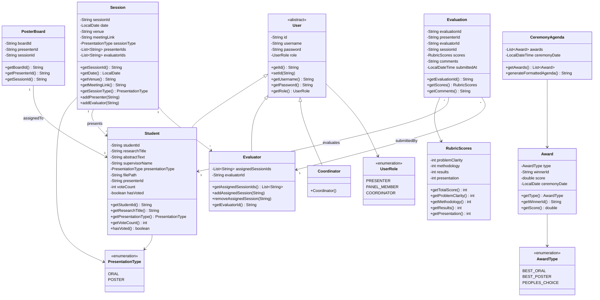
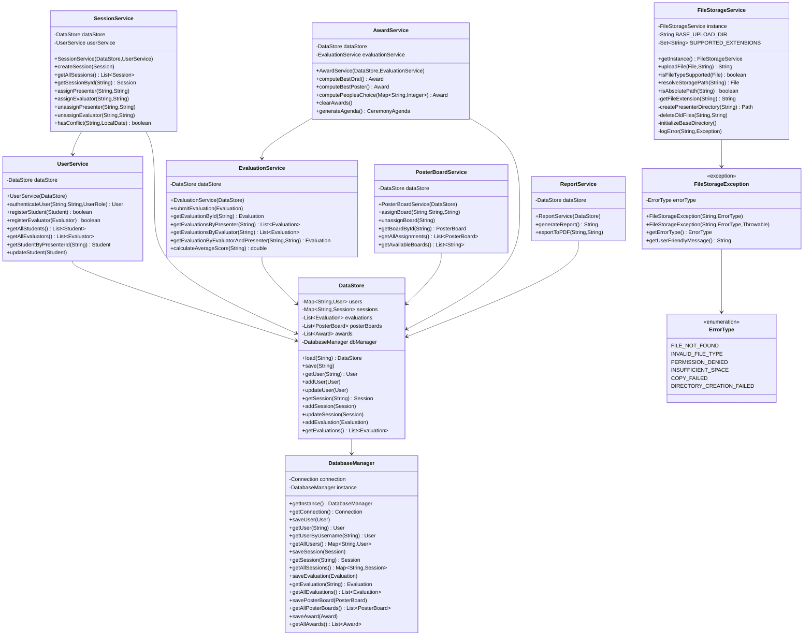
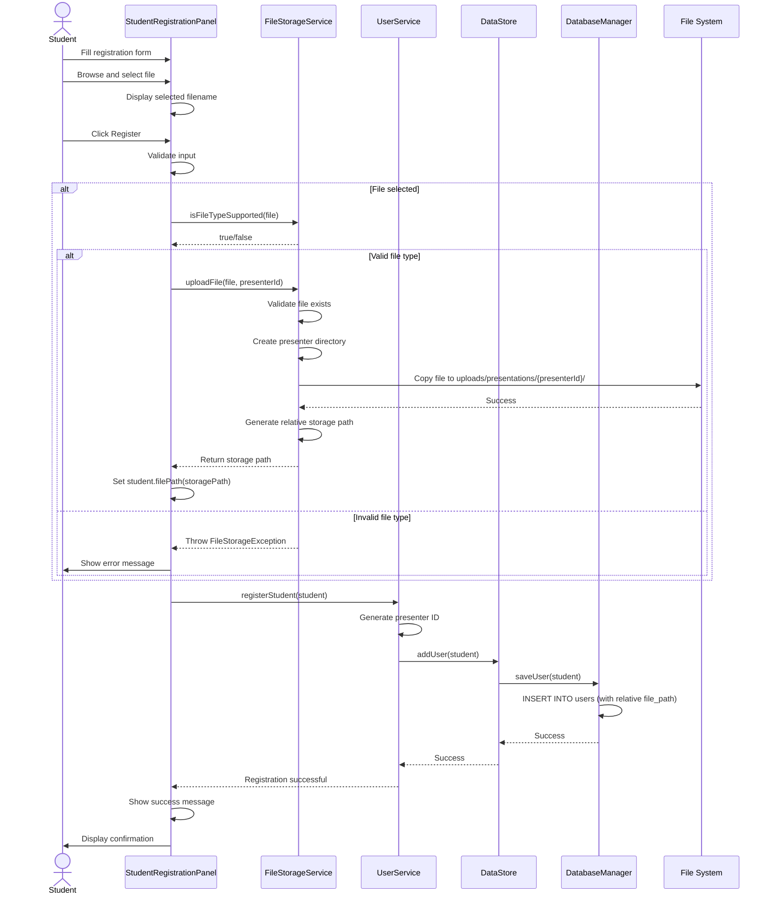
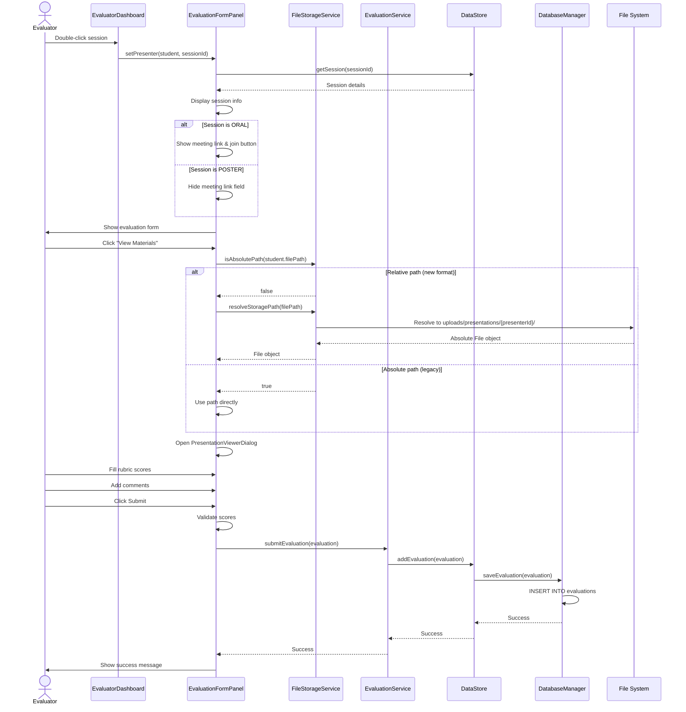
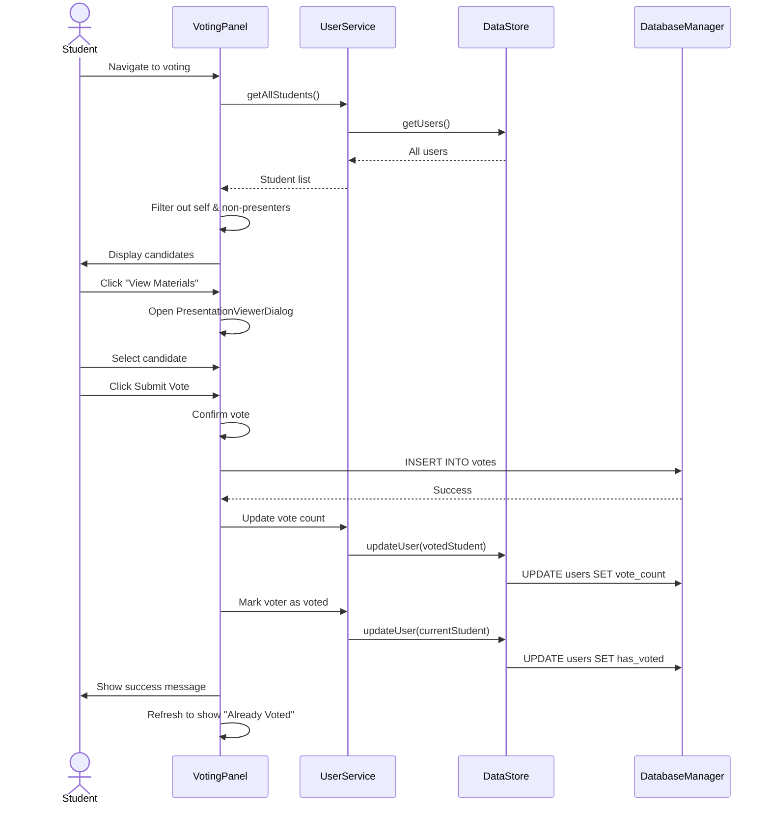
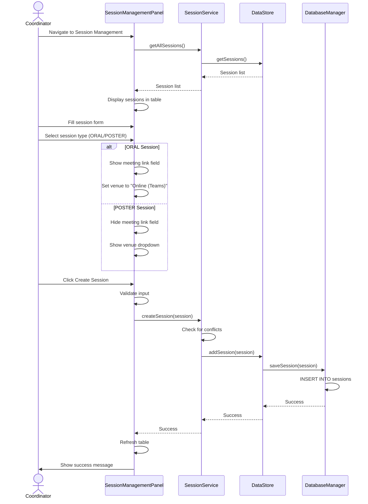
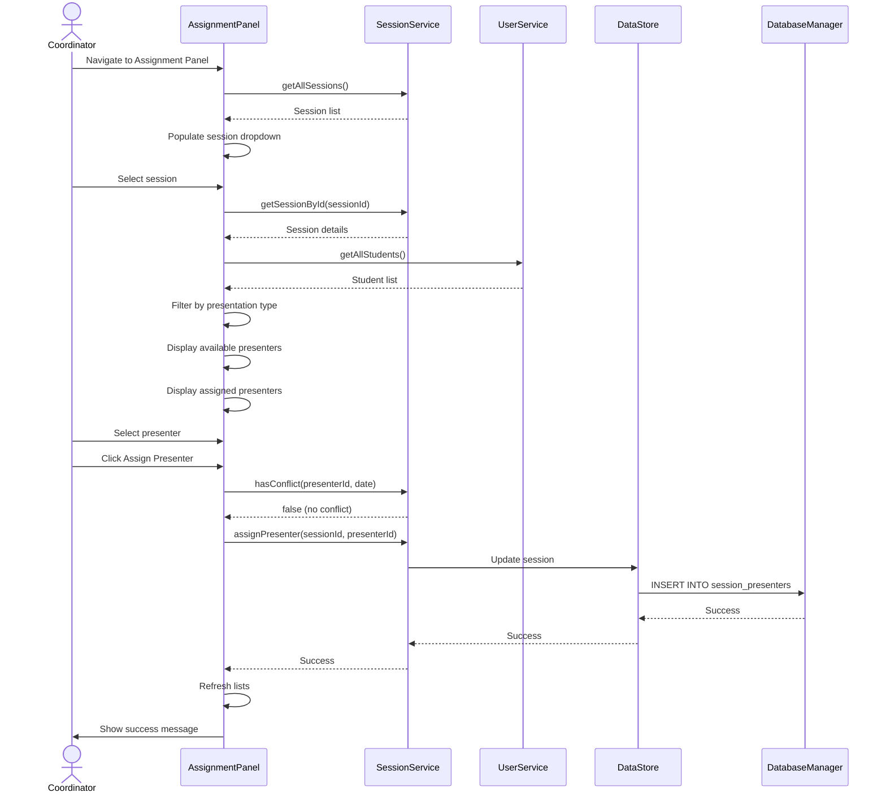
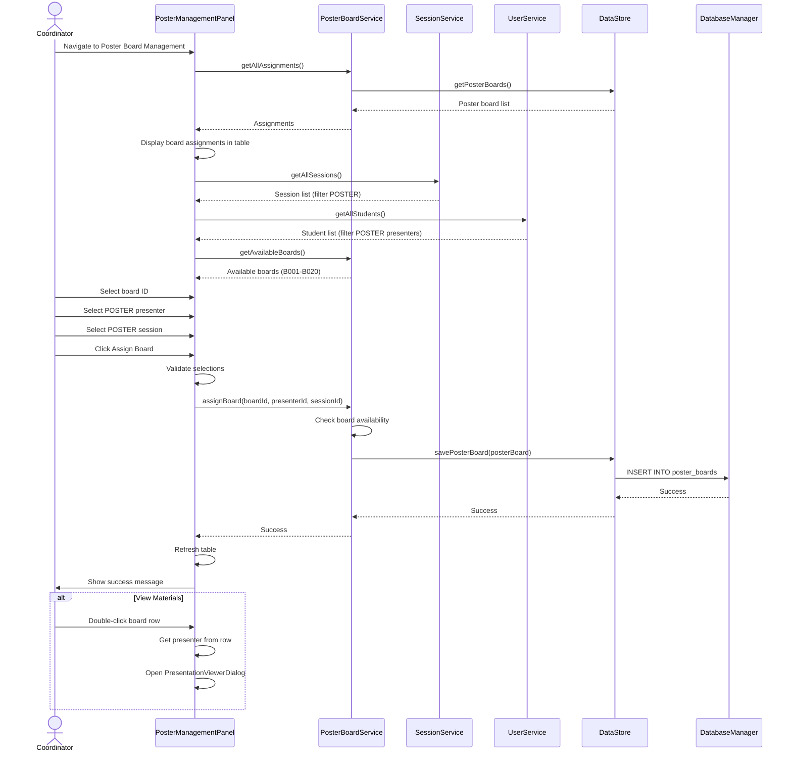
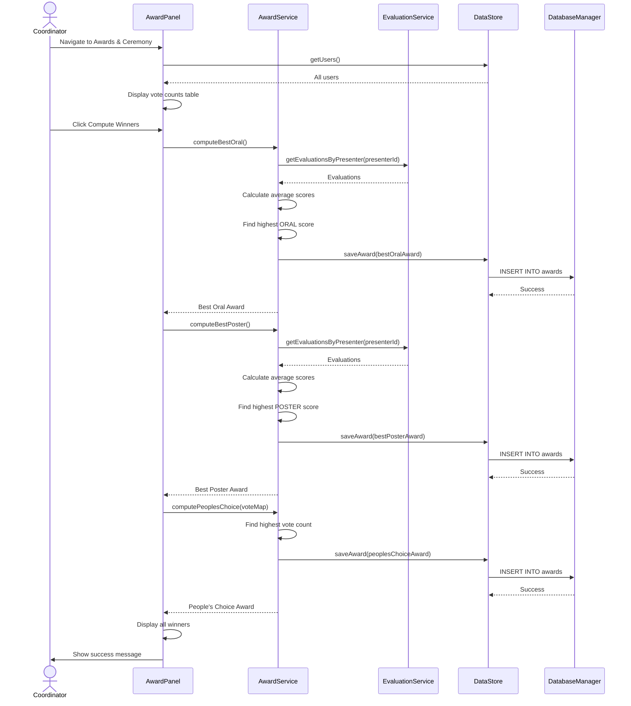

# Seminar Management System - UML Diagrams

This document contains UML diagrams for the Seminar Management System using Mermaid syntax.

## Table of Contents
1. [Class Diagram - Domain Model](#1-class-diagram---domain-model)
2. [Class Diagram - Service Layer](#2-class-diagram---service-layer)
3. [Class Diagram - UI Layer](#3-class-diagram---ui-layer)
4. [Sequence Diagram - Student Registration](#4-sequence-diagram---student-registration)
5. [Sequence Diagram - Evaluation Submission](#5-sequence-diagram---evaluation-submission)
6. [Sequence Diagram - Voting Process](#6-sequence-diagram---voting-process)
7. [Sequence Diagram - Session Management](#7-sequence-diagram---session-management)
8. [Sequence Diagram - Presenter Assignment](#8-sequence-diagram---presenter-assignment)
9. [Sequence Diagram - Poster Board Assignment](#9-sequence-diagram---poster-board-assignment)
10. [Sequence Diagram - Award Computation](#10-sequence-diagram---award-computation)

---

## 1. Class Diagram - Domain Model

```mermaid
classDiagram
    class User {
        <<abstract>>
        -String id
        -String username
        -String password
        -UserRole role
        +getId() String
        +setId(String)
        +getUsername() String
        +getPassword() String
        +getRole() UserRole
    }
    
    class Student {
        -String studentId
        -String researchTitle
        -String abstractText
        -String supervisorName
        -PresentationType presentationType
        -String filePath
        -String presenterId
        -int voteCount
        -boolean hasVoted
        +getStudentId() String
        +getResearchTitle() String
        +getPresentationType() PresentationType
        +getVoteCount() int
        +hasVoted() boolean
    }
    
    class Evaluator {
        -List~String~ assignedSessionIds
        -String evaluatorId
        +getAssignedSessionIds() List~String~
        +addAssignedSession(String)
        +removeAssignedSession(String)
        +getEvaluatorId() String
    }
    
    class Coordinator {
        +Coordinator()
    }
    
    class Session {
        -String sessionId
        -LocalDate date
        -String venue
        -String meetingLink
        -PresentationType sessionType
        -List~String~ presenterIds
        -List~String~ evaluatorIds
        +getSessionId() String
        +getDate() LocalDate
        +getVenue() String
        +getMeetingLink() String
        +getSessionType() PresentationType
        +addPresenter(String)
        +addEvaluator(String)
    }
    
    class Evaluation {
        -String evaluationId
        -String presenterId
        -String evaluatorId
        -String sessionId
        -RubricScores scores
        -String comments
        -LocalDateTime submittedAt
        +getEvaluationId() String
        +getScores() RubricScores
        +getComments() String
    }
    
    class RubricScores {
        -int problemClarity
        -int methodology
        -int results
        -int presentation
        +getTotalScore() int
        +getProblemClarity() int
        +getMethodology() int
        +getResults() int
        +getPresentation() int
    }
    
    class PosterBoard {
        -String boardId
        -String presenterId
        -String sessionId
        +getBoardId() String
        +getPresenterId() String
        +getSessionId() String
    }
    
    class Award {
        -AwardType type
        -String winnerId
        -double score
        -LocalDate ceremonyDate
        +getType() AwardType
        +getWinnerId() String
        +getScore() double
    }
    
    class CeremonyAgenda {
        -List~Award~ awards
        -LocalDateTime ceremonyDate
        +getAwards() List~Award~
        +generateFormattedAgenda() String
    }
    
    class UserRole {
        <<enumeration>>
        PRESENTER
        PANEL_MEMBER
        COORDINATOR
    }
    
    class PresentationType {
        <<enumeration>>
        ORAL
        POSTER
    }
    
    class AwardType {
        <<enumeration>>
        BEST_ORAL
        BEST_POSTER
        PEOPLES_CHOICE
    }
    
    User <|-- Student
    User <|-- Evaluator
    User <|-- Coordinator
    User --> UserRole
    Student --> PresentationType
    Session --> PresentationType
    Evaluation --> RubricScores
    Award --> AwardType
    CeremonyAgenda --> Award
    Session "1" --> "*" Student : presents
    Session "1" --> "*" Evaluator : evaluates
    Evaluation "*" --> "1" Student : evaluates
    Evaluation "*" --> "1" Evaluator : submittedBy
    PosterBoard "1" --> "1" Student : assignedTo
```

---

## 2. Class Diagram - Service Layer

```mermaid
classDiagram
    class DatabaseManager {
        -Connection connection
        -DatabaseManager instance
        +getInstance() DatabaseManager
        +getConnection() Connection
        +saveUser(User)
        +getUser(String) User
        +getUserByUsername(String) User
        +getAllUsers() Map~String,User~
        +saveSession(Session)
        +getSession(String) Session
        +getAllSessions() Map~String,Session~
        +saveEvaluation(Evaluation)
        +getEvaluation(String) Evaluation
        +getAllEvaluations() List~Evaluation~
        +savePosterBoard(PosterBoard)
        +getAllPosterBoards() List~PosterBoard~
        +saveAward(Award)
        +getAllAwards() List~Award~
    }
    
    class DataStore {
        -Map~String,User~ users
        -Map~String,Session~ sessions
        -List~Evaluation~ evaluations
        -List~PosterBoard~ posterBoards
        -List~Award~ awards
        -DatabaseManager dbManager
        +load(String) DataStore
        +save(String)
        +getUser(String) User
        +addUser(User)
        +updateUser(User)
        +getSession(String) Session
        +addSession(Session)
        +updateSession(Session)
        +addEvaluation(Evaluation)
        +getEvaluations() List~Evaluation~
    }
    
    class UserService {
        -DataStore dataStore
        +UserService(DataStore)
        +authenticateUser(String,String,UserRole) User
        +registerStudent(Student) boolean
        +registerEvaluator(Evaluator) boolean
        +getAllStudents() List~Student~
        +getAllEvaluators() List~Evaluator~
        +getStudentByPresenterId(String) Student
        +updateStudent(Student)
    }
    
    class SessionService {
        -DataStore dataStore
        -UserService userService
        +SessionService(DataStore,UserService)
        +createSession(Session)
        +getAllSessions() List~Session~
        +getSessionById(String) Session
        +assignPresenter(String,String)
        +assignEvaluator(String,String)
        +unassignPresenter(String,String)
        +unassignEvaluator(String,String)
        +hasConflict(String,LocalDate) boolean
    }
    
    class EvaluationService {
        -DataStore dataStore
        +EvaluationService(DataStore)
        +submitEvaluation(Evaluation)
        +getEvaluationById(String) Evaluation
        +getEvaluationsByPresenter(String) List~Evaluation~
        +getEvaluationsByEvaluator(String) List~Evaluation~
        +getEvaluationByEvaluatorAndPresenter(String,String) Evaluation
        +calculateAverageScore(String) double
    }
    
    class PosterBoardService {
        -DataStore dataStore
        +PosterBoardService(DataStore)
        +assignBoard(String,String,String)
        +unassignBoard(String)
        +getBoardById(String) PosterBoard
        +getAllAssignments() List~PosterBoard~
        +getAvailableBoards() List~String~
    }
    
    class AwardService {
        -DataStore dataStore
        -EvaluationService evaluationService
        +AwardService(DataStore,EvaluationService)
        +computeBestOral() Award
        +computeBestPoster() Award
        +computePeoplesChoice(Map~String,Integer~) Award
        +clearAwards()
        +generateAgenda() CeremonyAgenda
    }
    
    class ReportService {
        -DataStore dataStore
        +ReportService(DataStore)
        +generateReport() String
        +exportToPDF(String,String)
    }
    
    class FileStorageService {
        -FileStorageService instance
        -String BASE_UPLOAD_DIR
        -Set~String~ SUPPORTED_EXTENSIONS
        +getInstance() FileStorageService
        +uploadFile(File,String) String
        +isFileTypeSupported(File) boolean
        +resolveStoragePath(String) File
        +isAbsolutePath(String) boolean
        -getFileExtension(String) String
        -createPresenterDirectory(String) Path
        -deleteOldFiles(String,String)
        -initializeBaseDirectory()
        -logError(String,Exception)
    }
    
    class FileStorageException {
        <<exception>>
        -ErrorType errorType
        +FileStorageException(String,ErrorType)
        +FileStorageException(String,ErrorType,Throwable)
        +getErrorType() ErrorType
        +getUserFriendlyMessage() String
    }
    
    class ErrorType {
        <<enumeration>>
        FILE_NOT_FOUND
        INVALID_FILE_TYPE
        PERMISSION_DENIED
        INSUFFICIENT_SPACE
        COPY_FAILED
        DIRECTORY_CREATION_FAILED
    }
    
    DataStore --> DatabaseManager
    UserService --> DataStore
    SessionService --> DataStore
    SessionService --> UserService
    EvaluationService --> DataStore
    PosterBoardService --> DataStore
    AwardService --> DataStore
    AwardService --> EvaluationService
    ReportService --> DataStore
    FileStorageService --> FileStorageException
    FileStorageException --> ErrorType
```

---

## 3. Class Diagram - UI Layer

```mermaid
classDiagram
    class SeminarApp {
        -CardLayout cardLayout
        -JPanel mainPanel
        -DataStore dataStore
        -User currentUser
        -UserService userService
        -SessionService sessionService
        -EvaluationService evaluationService
        +SeminarApp()
        +showPanel(String)
        +getCurrentUser() User
        +setCurrentUser(User)
        +autoSave()
        +main(String[])
    }
    
    class LoginPanel {
        -SeminarApp app
        -UserService userService
        -JTextField usernameField
        -JPasswordField passwordField
        -JComboBox roleCombo
        +LoginPanel(SeminarApp,UserService)
        -login()
    }
    
    class SignUpPanel {
        -SeminarApp app
        -UserService userService
        -JTextField usernameField
        -JPasswordField passwordField
        -JComboBox roleCombo
        +SignUpPanel(SeminarApp,UserService)
        -signUp()
    }
    
    class StudentDashboard {
        -SeminarApp app
        -JLabel welcomeLabel
        +StudentDashboard(SeminarApp)
        +refresh()
        -navigateToRegistration()
        -navigateToVoting()
    }
    
    class StudentRegistrationPanel {
        -SeminarApp app
        -UserService userService
        -JTextField studentIdField
        -JTextField researchTitleField
        -JTextArea abstractArea
        -JComboBox presentationTypeCombo
        +StudentRegistrationPanel(SeminarApp,UserService)
        +refresh()
        -register()
        -uploadFile()
    }
    
    class VotingPanel {
        -SeminarApp app
        -UserService userService
        -JPanel candidatesPanel
        -ButtonGroup candidatesGroup
        +VotingPanel(SeminarApp,UserService)
        +refresh()
        -submitVote()
        -viewPresentationMaterials(Student)
    }
    
    class MySessionPanel {
        -SeminarApp app
        -SessionService sessionService
        -UserService userService
        -JLabel sessionTypeLabel
        -JLabel dateLabel
        -JLabel venueLabel
        +MySessionPanel(SeminarApp,SessionService,UserService)
        +refresh()
        -joinMeeting()
    }
    
    class EvaluatorDashboard {
        -SeminarApp app
        -SessionService sessionService
        -UserService userService
        -JTable assignmentsTable
        +EvaluatorDashboard(SeminarApp,SessionService,UserService)
        +refresh()
        -navigateToEvaluationForm()
    }
    
    class EvaluationFormPanel {
        -SeminarApp app
        -EvaluationService evaluationService
        -JSpinner problemClaritySpinner
        -JSpinner methodologySpinner
        -JTextArea commentsArea
        -Student selectedPresenter
        +EvaluationFormPanel(SeminarApp,EvaluationService,UserService)
        +setPresenter(Student,String)
        -submitEvaluation()
        -viewMaterials()
        -downloadMaterials()
    }
    
    class CoordinatorDashboard {
        -SeminarApp app
        +CoordinatorDashboard(SeminarApp)
        -navigateToSessionManagement()
        -navigateToAssignments()
        -navigateToAwards()
    }
    
    class SessionManagementPanel {
        -SeminarApp app
        -SessionService sessionService
        -JTable sessionTable
        -JComboBox venueCombo
        -JTextField meetingLinkField
        +SessionManagementPanel(SeminarApp,SessionService)
        +refresh()
        -createSession()
        -deleteSession()
    }
    
    class AssignmentPanel {
        -SeminarApp app
        -SessionService sessionService
        -UserService userService
        -JComboBox sessionCombo
        -JList availablePresentersList
        -JList assignedPresentersList
        +AssignmentPanel(SeminarApp,SessionService,UserService)
        +refresh()
        -assignPresenter()
        -assignEvaluator()
    }
    
    class PosterManagementPanel {
        -SeminarApp app
        -PosterBoardService posterBoardService
        -JTable boardTable
        -JComboBox boardIdCombo
        +PosterManagementPanel(SeminarApp,PosterBoardService,SessionService,UserService)
        +refresh()
        -assignBoard()
        -viewPresentationMaterials(int)
    }
    
    class AwardPanel {
        -SeminarApp app
        -AwardService awardService
        -JLabel bestOralLabel
        -JLabel bestPosterLabel
        -JLabel peoplesChoiceLabel
        +AwardPanel(SeminarApp,AwardService,UserService)
        +refresh()
        -computeWinners()
        -generateAgenda()
    }
    
    class UserManagementPanel {
        -SeminarApp app
        -UserService userService
        -JTable userTable
        +UserManagementPanel(SeminarApp,UserService)
        +refresh()
    }
    
    class PresentationViewerDialog {
        -Student student
        -JPanel contentPanel
        -JLabel zoomLabel
        -double zoomLevel
        +PresentationViewerDialog(Component,Student)
        -loadMaterials()
        -zoomIn()
        -zoomOut()
        -renderPDF(File)
    }
    
    SeminarApp --> LoginPanel
    SeminarApp --> SignUpPanel
    SeminarApp --> StudentDashboard
    SeminarApp --> StudentRegistrationPanel
    SeminarApp --> VotingPanel
    SeminarApp --> MySessionPanel
    SeminarApp --> EvaluatorDashboard
    SeminarApp --> EvaluationFormPanel
    SeminarApp --> CoordinatorDashboard
    SeminarApp --> SessionManagementPanel
    SeminarApp --> AssignmentPanel
    SeminarApp --> PosterManagementPanel
    SeminarApp --> AwardPanel
    SeminarApp --> UserManagementPanel
    VotingPanel --> PresentationViewerDialog
    PosterManagementPanel --> PresentationViewerDialog
    EvaluationFormPanel --> PresentationViewerDialog
```

---

## 4. Sequence Diagram - Student Registration

```mermaid
sequenceDiagram
    actor Student
    participant UI as StudentRegistrationPanel
    participant FileSvc as FileStorageService
    participant Service as UserService
    participant Store as DataStore
    participant DB as DatabaseManager
    participant FS as File System
    
    Student->>UI: Fill registration form
    Student->>UI: Browse and select file
    UI->>UI: Display selected filename
    Student->>UI: Click Register
    UI->>UI: Validate input
    
    alt File selected
        UI->>FileSvc: isFileTypeSupported(file)
        FileSvc-->>UI: true/false
        
        alt Valid file type
            UI->>FileSvc: uploadFile(file, presenterId)
            FileSvc->>FileSvc: Validate file exists
            FileSvc->>FileSvc: Create presenter directory
            FileSvc->>FS: Copy file to uploads/presentations/{presenterId}/
            FS-->>FileSvc: Success
            FileSvc->>FileSvc: Generate relative storage path
            FileSvc-->>UI: Return storage path
            UI->>UI: Set student.filePath(storagePath)
        else Invalid file type
            FileSvc-->>UI: Throw FileStorageException
            UI->>Student: Show error message
        end
    end
    
    UI->>Service: registerStudent(student)
    Service->>Service: Generate presenter ID
    Service->>Store: addUser(student)
    Store->>DB: saveUser(student)
    DB->>DB: INSERT INTO users (with relative file_path)
    DB-->>Store: Success
    Store-->>Service: Success
    Service-->>UI: Registration successful
    UI->>UI: Show success message
    UI->>Student: Display confirmation
```

---

## 5. Sequence Diagram - Evaluation Submission

```mermaid
sequenceDiagram
    actor Evaluator
    participant Dashboard as EvaluatorDashboard
    participant Form as EvaluationFormPanel
    participant FileSvc as FileStorageService
    participant EvalService as EvaluationService
    participant Store as DataStore
    participant DB as DatabaseManager
    participant FS as File System
    
    Evaluator->>Dashboard: Double-click session
    Dashboard->>Form: setPresenter(student, sessionId)
    Form->>Store: getSession(sessionId)
    Store-->>Form: Session details
    Form->>Form: Display session info
    
    alt Session is ORAL
        Form->>Form: Show meeting link & join button
    else Session is POSTER
        Form->>Form: Hide meeting link field
    end
    
    Form->>Evaluator: Show evaluation form
    
    Evaluator->>Form: Click "View Materials"
    Form->>FileSvc: isAbsolutePath(student.filePath)
    
    alt Relative path (new format)
        FileSvc-->>Form: false
        Form->>FileSvc: resolveStoragePath(filePath)
        FileSvc->>FS: Resolve to uploads/presentations/{presenterId}/
        FS-->>FileSvc: Absolute File object
        FileSvc-->>Form: File object
    else Absolute path (legacy)
        FileSvc-->>Form: true
        Form->>Form: Use path directly
    end
    
    Form->>Form: Open PresentationViewerDialog
    
    Evaluator->>Form: Fill rubric scores
    Evaluator->>Form: Add comments
    Evaluator->>Form: Click Submit
    
    Form->>Form: Validate scores
    Form->>EvalService: submitEvaluation(evaluation)
    EvalService->>Store: addEvaluation(evaluation)
    Store->>DB: saveEvaluation(evaluation)
    DB->>DB: INSERT INTO evaluations
    DB-->>Store: Success
    Store-->>EvalService: Success
    EvalService-->>Form: Success
    Form->>Evaluator: Show success message
```

---

## 6. Sequence Diagram - Voting Process

```mermaid
sequenceDiagram
    actor Student
    participant Voting as VotingPanel
    participant UserService as UserService
    participant Store as DataStore
    participant DB as DatabaseManager
    
    Student->>Voting: Navigate to voting
    Voting->>UserService: getAllStudents()
    UserService->>Store: getUsers()
    Store-->>UserService: All users
    UserService-->>Voting: Student list
    Voting->>Voting: Filter out self & non-presenters
    Voting->>Student: Display candidates
    
    Student->>Voting: Click "View Materials"
    Voting->>Voting: Open PresentationViewerDialog
    
    Student->>Voting: Select candidate
    Student->>Voting: Click Submit Vote
    Voting->>Voting: Confirm vote
    
    Voting->>DB: INSERT INTO votes
    DB-->>Voting: Success
    
    Voting->>UserService: Update vote count
    UserService->>Store: updateUser(votedStudent)
    Store->>DB: UPDATE users SET vote_count
    
    Voting->>UserService: Mark voter as voted
    UserService->>Store: updateUser(currentStudent)
    Store->>DB: UPDATE users SET has_voted
    
    Voting->>Student: Show success message
    Voting->>Voting: Refresh to show "Already Voted"
```

---

## 7. Sequence Diagram - Session Management

```mermaid
sequenceDiagram
    actor Coordinator
    participant Panel as SessionManagementPanel
    participant SessionSvc as SessionService
    participant Store as DataStore
    participant DB as DatabaseManager
    
    Coordinator->>Panel: Navigate to Session Management
    Panel->>SessionSvc: getAllSessions()
    SessionSvc->>Store: getSessions()
    Store-->>SessionSvc: Session list
    SessionSvc-->>Panel: Session list
    Panel->>Panel: Display sessions in table
    
    Coordinator->>Panel: Fill session form
    Coordinator->>Panel: Select session type (ORAL/POSTER)
    
    alt ORAL Session
        Panel->>Panel: Show meeting link field
        Panel->>Panel: Set venue to "Online (Teams)"
    else POSTER Session
        Panel->>Panel: Hide meeting link field
        Panel->>Panel: Show venue dropdown
    end
    
    Coordinator->>Panel: Click Create Session
    Panel->>Panel: Validate input
    Panel->>SessionSvc: createSession(session)
    SessionSvc->>SessionSvc: Check for conflicts
    SessionSvc->>Store: addSession(session)
    Store->>DB: saveSession(session)
    DB->>DB: INSERT INTO sessions
    DB-->>Store: Success
    Store-->>SessionSvc: Success
    SessionSvc-->>Panel: Success
    Panel->>Panel: Refresh table
    Panel->>Coordinator: Show success message
```

---

## 8. Sequence Diagram - Presenter Assignment

```mermaid
sequenceDiagram
    actor Coordinator
    participant Panel as AssignmentPanel
    participant SessionSvc as SessionService
    participant UserSvc as UserService
    participant Store as DataStore
    participant DB as DatabaseManager
    
    Coordinator->>Panel: Navigate to Assignment Panel
    Panel->>SessionSvc: getAllSessions()
    SessionSvc-->>Panel: Session list
    Panel->>Panel: Populate session dropdown
    
    Coordinator->>Panel: Select session
    Panel->>SessionSvc: getSessionById(sessionId)
    SessionSvc-->>Panel: Session details
    Panel->>UserSvc: getAllStudents()
    UserSvc-->>Panel: Student list
    Panel->>Panel: Filter by presentation type
    Panel->>Panel: Display available presenters
    Panel->>Panel: Display assigned presenters
    
    Coordinator->>Panel: Select presenter
    Coordinator->>Panel: Click Assign Presenter
    Panel->>SessionSvc: hasConflict(presenterId, date)
    SessionSvc-->>Panel: false (no conflict)
    Panel->>SessionSvc: assignPresenter(sessionId, presenterId)
    SessionSvc->>Store: Update session
    Store->>DB: INSERT INTO session_presenters
    DB-->>Store: Success
    Store-->>SessionSvc: Success
    SessionSvc-->>Panel: Success
    Panel->>Panel: Refresh lists
    Panel->>Coordinator: Show success message
```

---

## 9. Sequence Diagram - Poster Board Assignment

```mermaid
sequenceDiagram
    actor Coordinator
    participant Panel as PosterManagementPanel
    participant PosterSvc as PosterBoardService
    participant SessionSvc as SessionService
    participant UserSvc as UserService
    participant Store as DataStore
    participant DB as DatabaseManager
    
    Coordinator->>Panel: Navigate to Poster Board Management
    Panel->>PosterSvc: getAllAssignments()
    PosterSvc->>Store: getPosterBoards()
    Store-->>PosterSvc: Poster board list
    PosterSvc-->>Panel: Assignments
    Panel->>Panel: Display board assignments in table
    
    Panel->>SessionSvc: getAllSessions()
    SessionSvc-->>Panel: Session list (filter POSTER)
    Panel->>UserSvc: getAllStudents()
    UserSvc-->>Panel: Student list (filter POSTER presenters)
    Panel->>PosterSvc: getAvailableBoards()
    PosterSvc-->>Panel: Available boards (B001-B020)
    
    Coordinator->>Panel: Select board ID
    Coordinator->>Panel: Select POSTER presenter
    Coordinator->>Panel: Select POSTER session
    Coordinator->>Panel: Click Assign Board
    
    Panel->>Panel: Validate selections
    Panel->>PosterSvc: assignBoard(boardId, presenterId, sessionId)
    PosterSvc->>PosterSvc: Check board availability
    PosterSvc->>Store: savePosterBoard(posterBoard)
    Store->>DB: INSERT INTO poster_boards
    DB-->>Store: Success
    Store-->>PosterSvc: Success
    PosterSvc-->>Panel: Success
    Panel->>Panel: Refresh table
    Panel->>Coordinator: Show success message
    
    alt View Materials
        Coordinator->>Panel: Double-click board row
        Panel->>Panel: Get presenter from row
        Panel->>Panel: Open PresentationViewerDialog
    end
```

---

## 10. Sequence Diagram - Award Computation

```mermaid
sequenceDiagram
    actor Coordinator
    participant Panel as AwardPanel
    participant AwardSvc as AwardService
    participant EvalSvc as EvaluationService
    participant Store as DataStore
    participant DB as DatabaseManager
    
    Coordinator->>Panel: Navigate to Awards & Ceremony
    Panel->>Store: getUsers()
    Store-->>Panel: All users
    Panel->>Panel: Display vote counts table
    
    Coordinator->>Panel: Click Compute Winners
    
    Panel->>AwardSvc: computeBestOral()
    AwardSvc->>EvalSvc: getEvaluationsByPresenter(presenterId)
    EvalSvc-->>AwardSvc: Evaluations
    AwardSvc->>AwardSvc: Calculate average scores
    AwardSvc->>AwardSvc: Find highest ORAL score
    AwardSvc->>Store: saveAward(bestOralAward)
    Store->>DB: INSERT INTO awards
    DB-->>Store: Success
    AwardSvc-->>Panel: Best Oral Award
    
    Panel->>AwardSvc: computeBestPoster()
    AwardSvc->>EvalSvc: getEvaluationsByPresenter(presenterId)
    EvalSvc-->>AwardSvc: Evaluations
    AwardSvc->>AwardSvc: Calculate average scores
    AwardSvc->>AwardSvc: Find highest POSTER score
    AwardSvc->>Store: saveAward(bestPosterAward)
    Store->>DB: INSERT INTO awards
    DB-->>Store: Success
    AwardSvc-->>Panel: Best Poster Award
    
    Panel->>AwardSvc: computePeoplesChoice(voteMap)
    AwardSvc->>AwardSvc: Find highest vote count
    AwardSvc->>Store: saveAward(peoplesChoiceAward)
    Store->>DB: INSERT INTO awards
    DB-->>Store: Success
    AwardSvc-->>Panel: People's Choice Award
    
    Panel->>Panel: Display all winners
    Panel->>Coordinator: Show success message
```

---

## Diagram Usage Guide

### How to View These Diagrams

1. **GitHub/GitLab**: These platforms render Mermaid diagrams automatically
2. **VS Code**: Install "Markdown Preview Mermaid Support" extension
3. **Online**: Copy diagram code to https://mermaid.live/
4. **Documentation**: Use MkDocs with mermaid2 plugin

### Diagram Descriptions

- **Class Diagrams**: Show the structure of classes and their relationships
- **Sequence Diagrams**: Show the flow of operations over time for key workflows

---

## System Architecture Summary

### Layered Architecture
1. **Presentation Layer**: Swing UI components
2. **Application Layer**: SeminarApp controller
3. **Service Layer**: Business logic services
4. **Data Access Layer**: DataStore and DatabaseManager
5. **Domain Layer**: Entity models

### Design Patterns Used
- **Singleton**: DatabaseManager, DataStore, FileStorageService
- **MVC**: Model-View-Controller separation
- **Factory**: ID generation for users
- **Observer**: UI refresh on data changes
- **Strategy**: Different evaluation strategies for awards

### Key Technologies
- **UI Framework**: Java Swing
- **Database**: MySQL with JDBC
- **Connection Pool**: HikariCP
- **PDF Rendering**: Apache PDFBox
- **Date Picker**: JCalendar
- **Build Tool**: Maven

---

*Generated for Seminar Management System v1.0*
