# Seminar Management System - UML Diagrams

This document contains UML diagrams for the Seminar Management System using Mermaid syntax.

## Table of Contents
1. [Class Diagram - Domain Model](#1-class-diagram---domain-model)
2. [Class Diagram - Service Layer](#2-class-diagram---service-layer)
3. [Class Diagram - UI Layer](#3-class-diagram---ui-layer)
4. [Use Case Diagram](#4-use-case-diagram)
5. [Sequence Diagram - Student Registration](#5-sequence-diagram---student-registration)
6. [Sequence Diagram - Evaluation Submission](#6-sequence-diagram---evaluation-submission)
7. [Sequence Diagram - Voting Process](#7-sequence-diagram---voting-process)
8. [Entity Relationship Diagram](#8-entity-relationship-diagram)
9. [Component Diagram](#9-component-diagram)
10. [State Diagram - Session Lifecycle](#10-state-diagram---session-lifecycle)

---

## 1. Class Diagram - Domain Model

---

## 2. Class Diagram - Service Layer

---

## 3. Class Diagram - UI Layer

```mermaid
classDiagram
    class SeminarApp {
        -CardLayout cardLayout
        -JPanel mainPanel
        -DataStore dataStore
        -User currentUser
        -UserService userService
        -SessionService sessionService
        -EvaluationService evaluationService
        +SeminarApp()
        +showPanel(String)
        +getCurrentUser() User
        +setCurrentUser(User)
        +autoSave()
        +main(String[])
    }
    
    class LoginPanel {
        -SeminarApp app
        -UserService userService
        -JTextField usernameField
        -JPasswordField passwordField
        -JComboBox roleCombo
        +LoginPanel(SeminarApp,UserService)
        -login()
    }
    
    class SignUpPanel {
        -SeminarApp app
        -UserService userService
        -JTextField usernameField
        -JPasswordField passwordField
        -JComboBox roleCombo
        +SignUpPanel(SeminarApp,UserService)
        -signUp()
    }
    
    class StudentDashboard {
        -SeminarApp app
        -JLabel welcomeLabel
        +StudentDashboard(SeminarApp)
        +refresh()
        -navigateToRegistration()
        -navigateToVoting()
    }
    
    class StudentRegistrationPanel {
        -SeminarApp app
        -UserService userService
        -JTextField studentIdField
        -JTextField researchTitleField
        -JTextArea abstractArea
        -JComboBox presentationTypeCombo
        +StudentRegistrationPanel(SeminarApp,UserService)
        +refresh()
        -register()
        -uploadFile()
    }
    
    class VotingPanel {
        -SeminarApp app
        -UserService userService
        -JPanel candidatesPanel
        -ButtonGroup candidatesGroup
        +VotingPanel(SeminarApp,UserService)
        +refresh()
        -submitVote()
        -viewPresentationMaterials(Student)
    }
    
    class MySessionPanel {
        -SeminarApp app
        -SessionService sessionService
        -UserService userService
        -JLabel sessionTypeLabel
        -JLabel dateLabel
        -JLabel venueLabel
        +MySessionPanel(SeminarApp,SessionService,UserService)
        +refresh()
        -joinMeeting()
    }
    
    class EvaluatorDashboard {
        -SeminarApp app
        -SessionService sessionService
        -UserService userService
        -JTable assignmentsTable
        +EvaluatorDashboard(SeminarApp,SessionService,UserService)
        +refresh()
        -navigateToEvaluationForm()
    }
    
    class EvaluationFormPanel {
        -SeminarApp app
        -EvaluationService evaluationService
        -JSpinner problemClaritySpinner
        -JSpinner methodologySpinner
        -JTextArea commentsArea
        -Student selectedPresenter
        +EvaluationFormPanel(SeminarApp,EvaluationService,UserService)
        +setPresenter(Student,String)
        -submitEvaluation()
        -viewMaterials()
        -downloadMaterials()
    }
    
    class CoordinatorDashboard {
        -SeminarApp app
        +CoordinatorDashboard(SeminarApp)
        -navigateToSessionManagement()
        -navigateToAssignments()
        -navigateToAwards()
    }
    
    class SessionManagementPanel {
        -SeminarApp app
        -SessionService sessionService
        -JTable sessionTable
        -JComboBox venueCombo
        -JTextField meetingLinkField
        +SessionManagementPanel(SeminarApp,SessionService)
        +refresh()
        -createSession()
        -deleteSession()
    }
    
    class AssignmentPanel {
        -SeminarApp app
        -SessionService sessionService
        -UserService userService
        -JComboBox sessionCombo
        -JList availablePresentersList
        -JList assignedPresentersList
        +AssignmentPanel(SeminarApp,SessionService,UserService)
        +refresh()
        -assignPresenter()
        -assignEvaluator()
    }
    
    class PosterManagementPanel {
        -SeminarApp app
        -PosterBoardService posterBoardService
        -JTable boardTable
        -JComboBox boardIdCombo
        +PosterManagementPanel(SeminarApp,PosterBoardService,SessionService,UserService)
        +refresh()
        -assignBoard()
        -viewPresentationMaterials(int)
    }
    
    class AwardPanel {
        -SeminarApp app
        -AwardService awardService
        -JLabel bestOralLabel
        -JLabel bestPosterLabel
        -JLabel peoplesChoiceLabel
        +AwardPanel(SeminarApp,AwardService,UserService)
        +refresh()
        -computeWinners()
        -generateAgenda()
    }
    
    class UserManagementPanel {
        -SeminarApp app
        -UserService userService
        -JTable userTable
        +UserManagementPanel(SeminarApp,UserService)
        +refresh()
    }
    
    class PresentationViewerDialog {
        -Student student
        -JPanel contentPanel
        -JLabel zoomLabel
        -double zoomLevel
        +PresentationViewerDialog(Component,Student)
        -loadMaterials()
        -zoomIn()
        -zoomOut()
        -renderPDF(File)
    }
    
    SeminarApp --> LoginPanel
    SeminarApp --> SignUpPanel
    SeminarApp --> StudentDashboard
    SeminarApp --> StudentRegistrationPanel
    SeminarApp --> VotingPanel
    SeminarApp --> MySessionPanel
    SeminarApp --> EvaluatorDashboard
    SeminarApp --> EvaluationFormPanel
    SeminarApp --> CoordinatorDashboard
    SeminarApp --> SessionManagementPanel
    SeminarApp --> AssignmentPanel
    SeminarApp --> PosterManagementPanel
    SeminarApp --> AwardPanel
    SeminarApp --> UserManagementPanel
    VotingPanel --> PresentationViewerDialog
    PosterManagementPanel --> PresentationViewerDialog
    EvaluationFormPanel --> PresentationViewerDialog
```

---

## 4. Use Case Diagram

---

## 5. Sequence Diagram - Student Registration

---

## 6. Sequence Diagram - Evaluation Submission

---

## 7. Sequence Diagram - Voting Process

---

## 8. Entity Relationship Diagram

---

## 9. Component Diagram

---

## 10. State Diagram - Session Lifecycle

---

## Additional Diagrams

### Activity Diagram - Award Computation Process

### Deployment Diagram

---

## Diagram Usage Guide

### How to View These Diagrams

1. **GitHub/GitLab**: These platforms render Mermaid diagrams automatically
2. **VS Code**: Install "Markdown Preview Mermaid Support" extension
3. **Online**: Copy diagram code to https://mermaid.live/
4. **Documentation**: Use MkDocs with mermaid2 plugin

### Diagram Descriptions

- **Class Diagrams**: Show the structure of classes and their relationships
- **Use Case Diagram**: Shows what each user role can do
- **Sequence Diagrams**: Show the flow of operations over time
- **ER Diagram**: Shows database table relationships
- **Component Diagram**: Shows system architecture and dependencies
- **State Diagram**: Shows session lifecycle states
- **Activity Diagram**: Shows the award computation workflow
- **Deployment Diagram**: Shows physical deployment architecture

---

## System Architecture Summary

### Layered Architecture
1. **Presentation Layer**: Swing UI components
2. **Application Layer**: SeminarApp controller
3. **Service Layer**: Business logic services
4. **Data Access Layer**: DataStore and DatabaseManager
5. **Domain Layer**: Entity models

### Design Patterns Used
- **Singleton**: DatabaseManager, DataStore
- **MVC**: Model-View-Controller separation
- **Factory**: ID generation for users
- **Observer**: UI refresh on data changes
- **Strategy**: Different evaluation strategies for awards

### Key Technologies
- **UI Framework**: Java Swing
- **Database**: MySQL with JDBC
- **Connection Pool**: HikariCP
- **PDF Rendering**: Apache PDFBox
- **Date Picker**: JCalendar
- **Build Tool**: Maven

---

*Generated for Seminar Management System v1.0*
